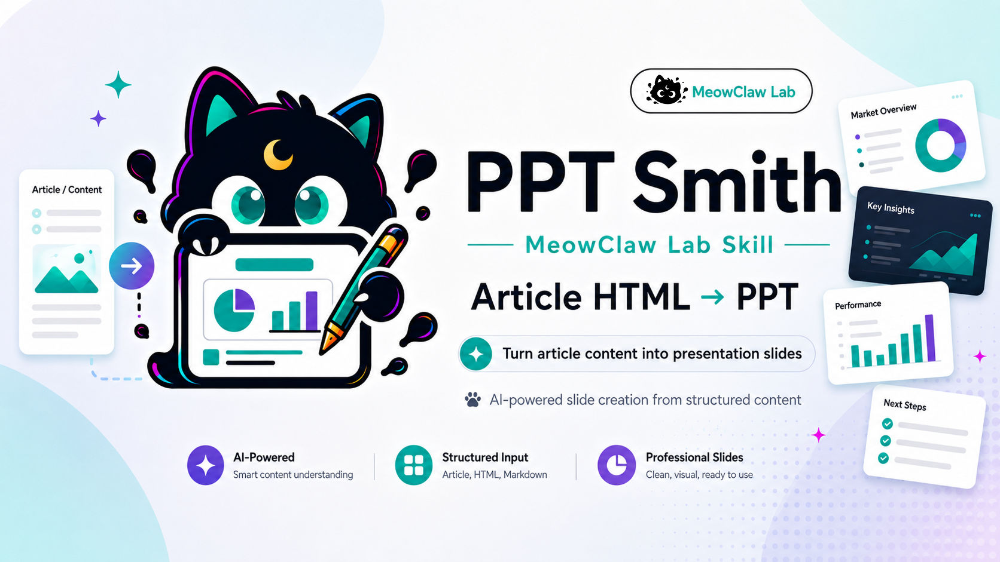

# MeowClaw PPT Smith

<p align="center">
  
</p>

> [中文](README.md) · [Skill entry point](SKILL.md) · [Workflow](references/declarative-design.md) · [Editable sample](assets/samples/v5.1-no-image-policy-native.pptx)

Turn source documents, slide design images, or native PPTX templates into editable presentations with source evidence and real rendered previews. The model develops the narrative and design; a fixed backend creates native objects and checks delivery evidence.

**Current version: `5.1.0-dev.1` (development version, not a formal release).** Public slug: `meowclaw-pptsmith`. Compatible installation names: `article-html-to-ppt` and `meowclaw-decksmith`. License: Apache-2.0.

## Three ways to use it

| Your task | Input | Route and result |
| --- | --- | --- |
| Turn a report, policy document, PRD, or article into a presentation | Source material; optional brand or style references | **create**: design for the content and audience, then produce native PPTX and real previews |
| Reconstruct a designer's complete slide images | Full slide designs; source documents for checking text and numbers | **recreate**: rebuild editable objects and review against the approved target |
| Use a company or client template | Native PPTX template and source material | **template**: reuse native components and fill gaps using the template's visual rules |

A style reference usually belongs to create; faithful reconstruction of complete pages belongs to recreate. Native templates use the separate Template workflow. Source page count does not determine slide count.

**The visual style is not fixed.** Typography, palette, composition, charts, and page rhythm follow the current content, audience, and brand constraints. Reusable styles, source references, and decorative symbols reduce repetition without imposing one page layout.

## Design previews without an image-generation model

The default original-design workflow is:

```text
Full source → content and evidence → structured design
→ native editable PPTX → LibreOffice PDF → PNG previews
→ independent visual review and revisions → edit/save/reopen checks → delivery
```

A model that understands images and writes text can describe layouts and inspect programmatic renders. It does not need to generate bitmap images itself. This workflow creates an internal native candidate before producing its design preview. Image generation remains optional for illustrations or an explicitly requested external design target.

| Available capability | Supported workflow |
| --- | --- |
| Vision, no image generation | Create original slides, reconstruct supplied designs, inspect actual previews |
| Vision and image generation | Add independent image assets when needed |
| Text-only model | Author structured designs; use another visual reviewer or a human for image understanding and independent visual acceptance |
| No office renderer | Prepare content and design, then install rendering tools before final delivery |

Photography and complex illustration still require suitable assets. The declarative entry point does not accept arbitrary HTML/CSS, SVG, or model-authored scripts, and does not promise lossless reconstruction of every reference. Recoverable chart/table data stays native; a replaceable image does not make its internal elements editable.

## v5.1 example: six Chinese slides, no image generation

An independent author used the current Skill and a seven-page user-provided PDF, *AI SME Entrepreneurship Support Plan (2026–2028)*, to create a six-slide Chinese overview without image-generation calls. Every slide includes speaker notes and source references. The 90-day action sequence is explicitly labeled as an author recommendation.

Download the same [editable PPTX](assets/samples/v5.1-no-image-policy-native.pptx), or inspect the [object counts and acceptance evidence](assets/samples/v5.1-no-image-policy-evidence.json). These images are unmodified previews rendered from that PPTX.

### Cover: 13 text objects and 6 native shapes


### Targets: 16 text objects and 3 native shapes


### Actions: 18 text objects and 5 native shapes


Counts come directly from the delivered PPTX. Each text box or shape is counted once:

| Slide | Native text | Native shapes | Editable objects |
| --- | ---: | ---: | ---: |
| 1 · Policy overview | 13 | 6 | 19 |
| 2 · Three-year targets | 16 | 3 | 19 |
| 3 · Resource supply | 15 | 4 | 19 |
| 4 · Enterprise development | 12 | 3 | 15 |
| 5 · Open source and support | 20 | 5 | 25 |
| 6 · Author recommendations | 18 | 5 | 23 |
| **Total** | **94** | **26** | **120** |

This example contains **0 images, 0 native charts, 0 native tables, and 0 groups**, with notes on all six slides. Numbers are editable text; they are not counted as charts. Decorative lines and dots count as shapes. Characters and notes placeholders are not counted again. Object count describes editability, not design quality.

The candidate passed independent review of all pages and source content, reaching `final_delivery_ready`. On **macOS with LibreOffice 26.2.4.2**, Basic/UNO changed text, numeric text, and a shape fill on a disposable copy. Saving, closing, and reopening preserved the edits and all six notes; the original candidate stayed unchanged. This is an actual application-object edit test, not GUI clicking, and does not establish Windows/Linux or PowerPoint/WPS compatibility. The sample uses Arial Unicode MS without font embedding; verify fonts and layout on another device.

## How to use it with an agent

Load this directory's [SKILL.md](SKILL.md) in a host that can read Skills and execute local tools. Supply the source and intended outcome. Users do not need to write object JSON themselves.

**From a document, without image generation:**

```text
Use PPT Smith to turn this PDF into about 10 editable Chinese slides.
Audience: SME leaders. Goal: understand the policy and identify useful actions.
The model has vision but no image-generation tool.
Choose a visual style for the content. Preserve numeric qualifiers,
page-level sources and speaker notes. Label author advice separately.
Deliver after real rendering, independent review, and target-software edit/save/reopen checks.
```

**From complete design images:**

```text
Use these complete slide designs as reconstruction targets and the PDF
as evidence for text and numbers. Preserve the approved layout.
Identify conflicts that need correction. Keep text and recoverable chart/table data native.
Explain image and effect limitations and provide target/actual preview comparisons.
```

**From a native template:**

```text
Use this company PPTX template for a 15-slide Chinese report.
Reuse native components, preserve brand fonts and colours, and include sources and notes.
Adapt page structure where content does not fit, explain the changes,
and verify editing and saving in the target software.
```

**For a small revision:**

```text
Use the previous task. Change only the title on slide 6 and the notes on slide 7.
Apply object patches and review affected pages again.
Reuse unchanged-page review only through the verified inheritance mechanism.
```

Specify audience, purpose, language, slide budget, target software, and whether reference images express style or exact reconstruction. For revisions, retain the task directory and identify the affected pages/objects so the agent can load only the relevant context.

## Less repeated input and rework

- **Load instructions as needed:** the Skill entry keeps shared rules; route details load when selected.
- **Compact authoring:** reusable styles, sources, colour values, and symbols expand into strict native objects.
- **Short feedback:** build summaries point to complete evidence; content and objects can be inspected by page.
- **Real font preflight:** test office-rendered fonts and characters before expanding a large deck, with environment-bound caching.
- **Guarded patches and review inheritance:** revise objects without rewriting the task. Notes or data changes invalidate relevant review even when pixels stay the same.

Measurements for the same six-slide task, with exact semantic round-trip validation:

| Measurement | Original/full bytes | New/compact bytes | Reduction |
| --- | ---: | ---: | ---: |
| Skill entry, compared with v5.0.1 | 14,384 | 6,278 | 56.4% |
| Author input for the same task | 69,702 | 42,808 | 38.6% |
| CLI feedback for the same build | 24,550 | 631 | 97.4% |

These are UTF-8 byte counts, using identical canonical JSON encoding for task input. The [sample evidence](assets/samples/v5.1-no-image-policy-evidence.json) records the scope. **They are not measured token, billing, or runtime savings.** Full source, object, build, and review evidence remains on disk. Revisions still build and render the whole deck; inheritance reduces repeated review, not rendering work.

## Installation and local checks

Install Python dependencies from the Skill root. Bash example for macOS/Linux:

```bash
python3 -m venv .venv
source .venv/bin/activate
python -m pip install -r requirements.txt
python scripts/check_identity.py
python scripts/quick_validate_skill.py
python -m engine design capabilities
```

Real previews and font probes also require **LibreOffice, Poppler (pdftoppm, pdffonts, pdftotext), Fontconfig (fc-match), and the selected fonts**. Tools must be discoverable through PATH. On Windows use the corresponding virtual-environment Python executable; see [platform requirements](references/declarative-design.md#跨平台运行条件). `capabilities` checks local tools, not the host model's vision or image-generation capabilities.

The following illustrates the agent workflow. The model writes `author.json` from the source into the task directory; `init` does not parse a PDF or design slides by itself:

```bash
PPTSMITH_TASK="./ppt-work/demo"
python -m engine design init --task-dir "$PPTSMITH_TASK" --task-id demo --mode create --pages 6
python -m engine design author --task-dir "$PPTSMITH_TASK" --file author.json
python -m engine design preflight --task-dir "$PPTSMITH_TASK" --isolation auto
python -m engine design build --task-dir "$PPTSMITH_TASK" --isolation auto
```

A successful build is a candidate. Use its build ID to prepare the review, complete independent review and actual editing checks, then run `review` and `deliver`. `state.json` records continuation details; the task, build manifest, and original review retain full evidence. See [the workflow](references/declarative-design.md) and [compact authoring/revisions](references/declarative-authoring.md).

Only compatibility builders and tests using PptxGenJS require Node/npm plus:

```bash
python scripts/bootstrap_pptxgenjs_runtime.py
```

The script runs lockfile-pinned `npm ci` inside `runtime/pptxgenjs`. Development dependencies are listed in `requirements-dev.txt`.

## Delivery and compatibility boundaries

Final delivery includes editable PPTX, actual PDF/PNG previews, task and asset records, object inventory, review decisions, and editing limitations. Text, shapes, and recoverable data remain native wherever supported. An unapproved whole-slide screenshot cannot stand in for an editable deck.

Quality acceptance and OS isolation are separate. `--isolation auto` selects macOS isolation where available and host execution elsewhere. Host execution can deliver after quality checks, with OS isolation recorded as unverified. Explicit `--require-os-isolation` still blocks when isolation is unavailable. Runtime adapters do not establish actual application parity across operating systems.

The full regression run produced **815 effective passes and 18 skips**: 786 passed initially, and 29 real-render tests affected by the host sandbox passed after an authorized rerun. After the final CLI fixes, the declarative subset had **81 passes and 2 skips**. These sets overlap and must not be added. Skips cover unavailable reference fixtures, sample decks, and checks requiring actual Windows semantics.

Native template preservation continues through [Template](references/routes/v4-template-route.md). Bespoke is an advanced compatibility route; Standard/Engineering serves explicit engineering drafts and diagnostics. New `new_design` and `style_transfer` initializations map to create, while saved legacy tasks retain their original target requirements. A restricted browser design board, template-index cache, and measured model-cost dashboard are not included in this version.

## Historical examples

These are real renders from earlier versions and are not part of the v5.1 object counts above.

<details>
<summary>Show V4 Template and Bespoke examples</summary>

**Template: a 31-slide research presentation**, with notes on 29 body slides, using a source report and native template components.


**Bespoke: a 23-slide independent presentation**, with 12 native charts and notes on all 23 slides. These examples use different reports and are not a controlled quality comparison. They do not imply partnership, authorization, or endorsement by report publishers or template brands.


More historical assets are in the [sample directory](assets/samples/).

</details>

## Documentation and distribution

- [Skill execution contract](SKILL.md)
- [Declarative workflow, native objects, and acceptance](references/declarative-design.md)
- [Compact authoring, object patches, and review inheritance](references/declarative-authoring.md)
- [Template reuse](references/routes/v4-template-route.md) · [Bespoke compatibility](references/routes/v4-bespoke-route.md)
- [V4 route architecture](references/routes/v4-three-route-architecture.md) · [Historical export capabilities](references/export-pipelines.md)
- [Sample evidence](assets/samples/v5.1-no-image-policy-evidence.json)

Local building and rendering do not publish files. Source handling by the model depends on the host configuration. Feishu/Lark creation, upload, or sharing requires user authorization for that delivery.

The core engine, general components, editable objects, and QA are open source under Apache-2.0. Enterprise brand adaptations, dedicated masters, industry packages, custom components, and managed generation/deployment services are separate commercial deliverables, excluded from the public repository and Skill bundle.
