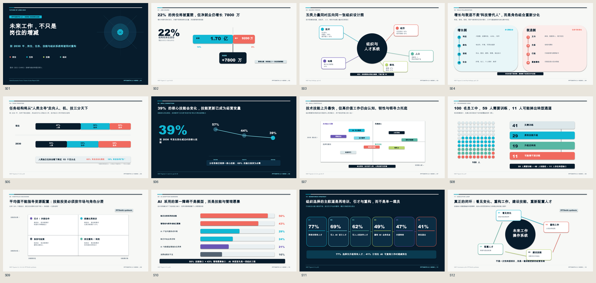
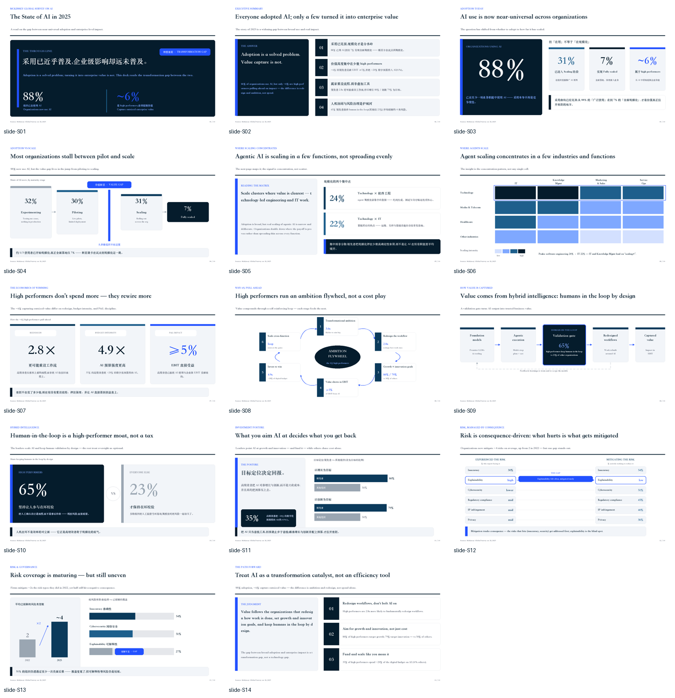
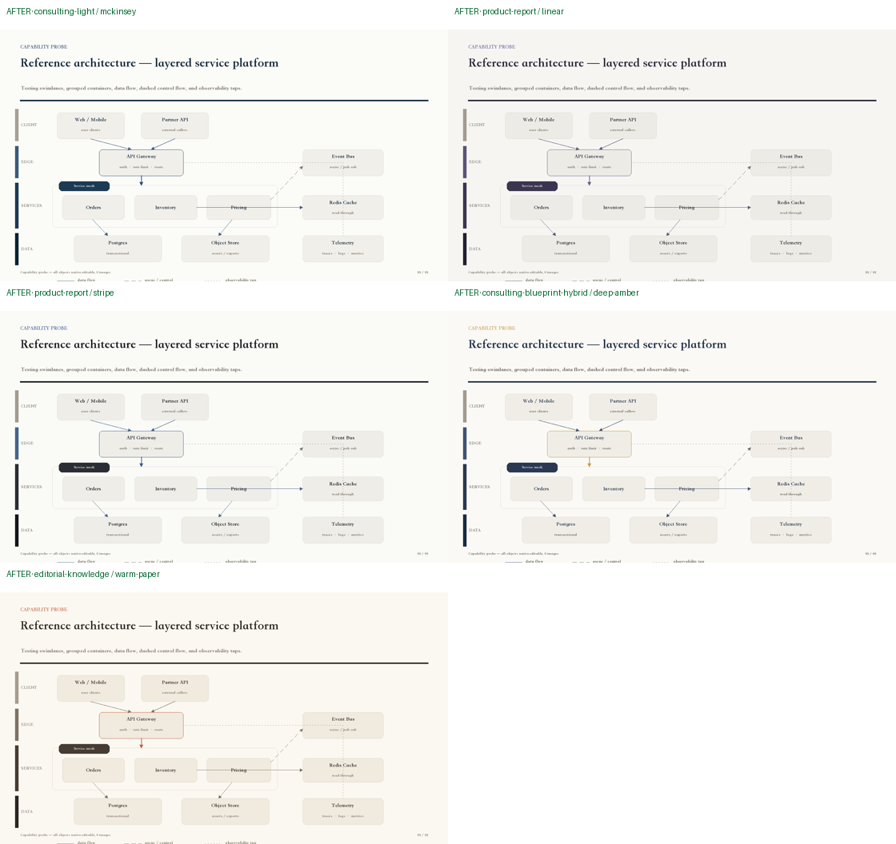
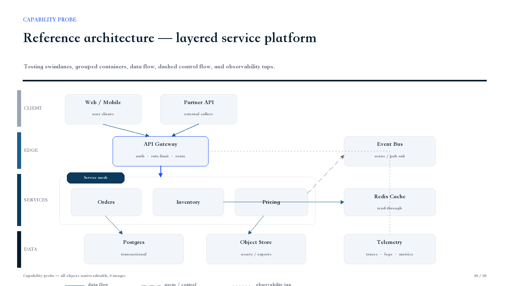
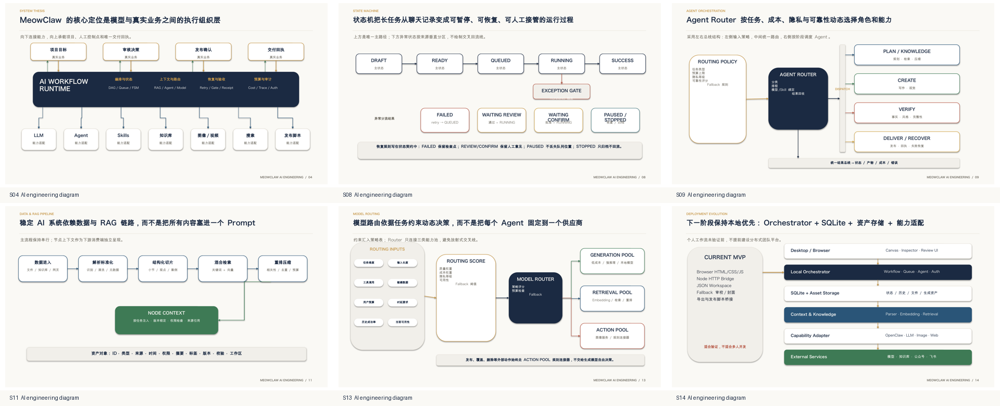
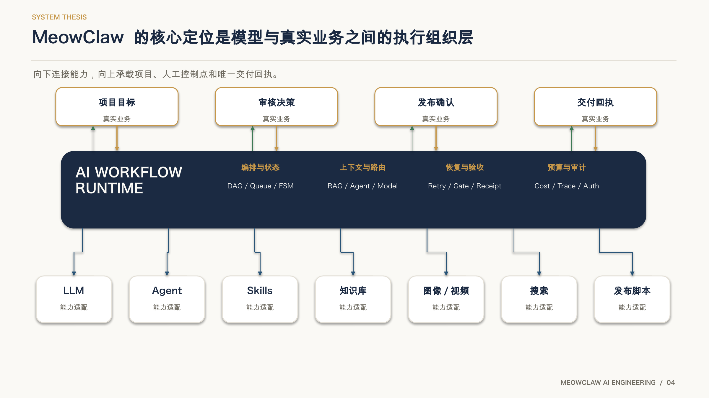
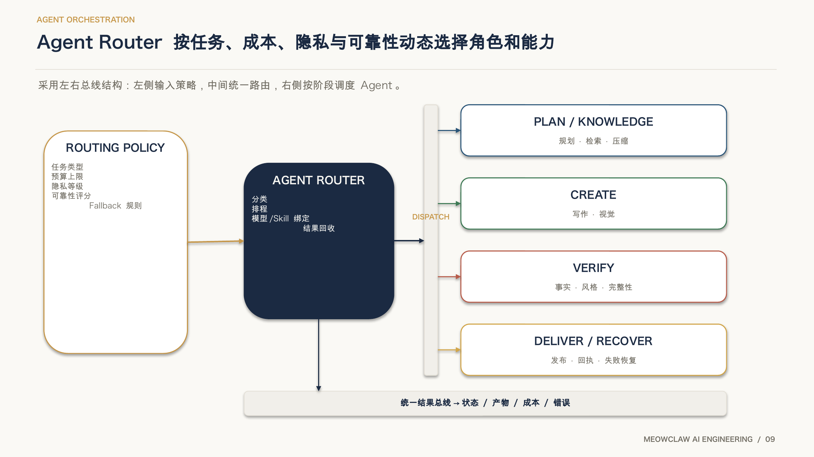
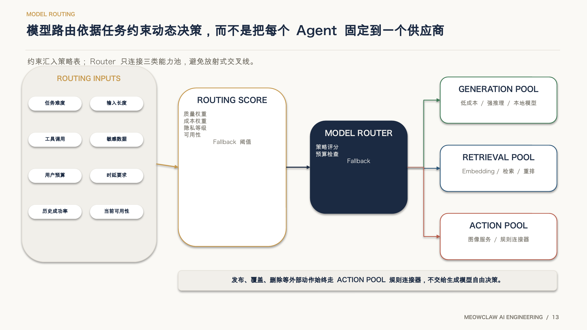

# MeowClaw PPT Smith

<p align="center">
  
</p>

> English documentation: [README.en.md](./README.en.md) · OpenClaw 执行规范：[SKILL.md](./SKILL.md)

把文章、Markdown、HTML、公众号草稿、PRD、研究材料与设计说明，转成**低返工、可编辑、可验证**的专业演示文稿。

- **公开品牌：** MeowClaw PPT Smith
- **兼容安装名：** `article-html-to-ppt`、`meowclaw-decksmith`
- **兼容搜索词：** MeowClaw PPTSmith、MeowClaw 夜猫 PPT 工坊
- **当前版本：** `4.1.0-beta.1`（模型主导三路线、模板组件复用、原生高定与可信交付）
- **公共标识：** `meowclaw-pptsmith`
- **许可证：** `Apache-2.0`
- **开源定位：** 核心引擎、基础五风格、通用组件、可编辑对象、QA 与可信交付

> PPTSmith 的 GitHub / ClawHub 开源版用于分发、获客与建立可信度。专业生产包、企业品牌适配、专属页面原型、定制组件和代生成/部署服务采用独立商业交付，不包含在本仓库与 ClawHub 包中。

## v4.1 Beta 一眼看懂

PPT Smith v4.1 Beta 是模型主导的演示创作系统。强模型负责理解来源、提炼叙事、设计页面和复核真实渲染；引擎负责来源锚定、原生对象执行、模板组件合同和失败关闭式 QA。

1. **Bespoke 高定路线**：模型从空白画布创作原生可编辑页面，追求视觉与内容上限。
2. **Template 路线**：分析用户 PPTX、建立 Component Atlas，优先复用并组合可行组件；缺失时按模板视觉语法补绘原生组件。
3. **Standard / Engineering 路线**：保留确定性编译、诊断和兼容能力，不冒充高质量最终稿。
4. **完整来源合同**：正文、数字、图表、插图和备注均可绑定来源锚点。
5. **整页设计合同**：拒绝“标题＋孤立组件”、低信息饱和度、重复骨架和占位值。
6. **原生可编辑交付**：标题、正文、图表、关系图、卡片和关键标签优先保留为 PowerPoint 原生对象。
7. **真实渲染与视觉批准**：只有绑定同一候选文件的结构检查、真实渲染和视觉复核全部通过，才能进入最终状态。
8. **失败时诚实收口**：缺少高质量 IR、模板合同、渲染器或视觉批准时明确阻断，不输出假成品。

> Beta 边界：Bespoke 与 Template 的质量依赖强模型，并要求逐任务真实渲染与人工/模型视觉复核；本版本不承诺任意模板、任意模型一次生成即可最终交付，也不承诺 Microsoft PowerPoint 与 LibreOffice 像素级一致。

### 安装与自检

```bash
python3 -m venv .venv
source .venv/bin/activate
python -m pip install -r requirements.txt
python scripts/bootstrap_pptxgenjs_runtime.py
python scripts/check_identity.py
python scripts/quick_validate_skill.py
python -m engine --help
```

开发与回归测试使用：

```bash
python -m pip install -r requirements-dev.txt
python -m pytest -q
```

### 历史：3.0.0 双路径基线

v3.0.0 将两条有明确边界的生成路径产品化：

- **Path A（高定代码路径）**：LLM 直接使用 `python-pptx` 编写独立构建脚本，保留 v1.2.0 曾经展现的非对称构图、飞轮、复杂原生箭头与逐页精修能力。触发词包括「精细做」「高定模式」「手写代码生成」「和之前 State of AI 一样」「质量优先」。
- **Path B（标准 IR / Pipeline 路径）**：以 PPT IR、Style Contract、组件路由、真实渲染与 QA 交付可追溯的稳定生产底线；IR 完整性与证据质量门禁要求主数据和独立证据都绑定来源，信息不足时以命名 blocker 停止，绝不因渲染成功而误标为 `verified`。适合批量、标准化、PMO/PRD/技术材料及需审计任务。

两条路径不是优劣替代：Path A 追求模型能力所能达到的视觉上限，正式交付仍需真实渲染与人工视觉复核；Path B 追求可验证与可重复的生产下限。详见 [v3.0.0 发布说明、v1.2.0 对比与多模型试验](docs/v3.0.0-release-notes.md)。

- 新增任务路由、Page Design Intent、Visual Planner、Deck Rhythm Gate 与受约束的二次精修请求。
- 新增原生可编辑热力矩阵、分层架构、指标下钻阶梯和阶段路线图 Renderer。
- Standard QA 阻断严重文本溢出、低对比文字、箭头凹口不安全文本、旧渲染证据和核心信息不可编辑。
- macOS PowerPoint 渲染路径改用 `osascript` 参数传递；测试夹具清理被限制在固定目录；能力探测只披露当前样式要求的字体。
- 保留 2.0.7 的原生连接器、端点绑定与图拓扑门禁；新版能力为增量升级。
- Standard 已在 macOS + LibreOffice 验收环境验证；Premium 仍需每次运行完成真实渲染、零错误 QA、评分和人工视觉复核。



### 2.0.7 连接器路由与图拓扑门禁

- 同轴相邻节点使用直线，跨行流程与总线使用原生肘形折线，反馈与恢复路径使用原生曲线。
- 多对一和一对多关系改用总线与短支线，禁止中心节点放射成不可读线团。
- QA 阻断连接器穿越无关节点或文字、主连接线交叉、悬空箭头和缺少层间路由通道。
- 复杂技术图必须先做单页放大渲染验收，再进入整套构建与联系表检查。
- 保留 2.0.6 的公开名称 **MeowClaw PPT Smith** 与 SEO/兼容别名，不回退旧展示名。

### 2.0.5 质量安全修复

- 简单流程图使用**单一带箭头连接器对象**，箭头不再由独立三角形或 chevron 色块模拟。
- `python_pptx` 流程连接器绑定两端形状连接点；移动节点时关系随之更新。
- Standard 能力按组件判定：复杂架构、层级、矩阵、飞轮、生态图与商业阶梯没有合格实现时直接阻断，不降级成文字框。
- QA 阻断未声明的空白实色色块，避免残留箭头头部、意外覆盖层和偶发多余色块。
- 文件可打开、文字可编辑、无越界、非空白只是结构条件，不再视为专业视觉质量证明。

## 样例图库

以下样例与仓库首页保持一致，并复制到 Skill 自有资产目录，确保从当前页面浏览时可直接查看。

### State of AI 2025：14 页完整演示样例



### 统一配色系统升级



### 原生可编辑技术架构图



## 2.0.7 AI 工程项目汇报样例

这组样例来自真实生成并通过 LibreOffice 渲染验收的 19 页 AI 项目汇报。重点展示 2.0.7 对执行组织层、状态机、Agent Router、RAG、模型路由和部署演进的升级。



### 执行组织层：跨层关系使用肘形折线

Runtime 与能力节点使用专用连接通道，避免斜直线穿越内容。



### Agent Router：总线代替放射式线团

Policy、Router、Dispatch Bus 与 Agent Group 分区表达，输出路径可逐条追踪。



### 模型路由：输入容器、策略评分与能力池

约束条件先汇入输入容器，再进入 Routing Score 和三类能力池；主路径与外部动作边界清晰。



## 适合谁

- **产品负责人 / 汇报人：** 决策摘要、指标、路线图、风险与下一步。
- **Agent 工程师 / 自动化开发者：** 工作流、架构、权限、失败模式、实施计划与 ROI。
- **自媒体作者 / 知识创作者：** 钩子、框架、案例、步骤、知识卡片与品牌节奏。
- **咨询、研究与业务团队：** 把长文、报告和证据整理成结构清晰、可追溯的正式 deck。

## 输入与输出

**常见输入**

- 文章、Markdown、HTML、微信公众号草稿
- PRD、产品方案、复盘、路线图
- 技术架构、自动化方案、Agent 工作流
- 研究材料、知识笔记、审稿通过的长文

**常见输出**

- `deck.pptx`：静态、可编辑 PPTX
- `deck-dynamic-native.pptx`：原生渐进式动态 PPTX
- `deck-preview.pdf`：在可用渲染环境下生成的预览
- `verification-report.md`：验证与限制说明
- `delivery-manifest.json`：可信交付状态与产物清单

## 快速使用

把材料、受众、目标和交付格式告诉 Agent：

```text
使用 MeowClaw PPTSmith（兼容路由 article-html-to-ppt）把这份 PRD 做成 10 页左右的可编辑 PPTX。
受众：产品管理层
目标：争取路线图审批
风格：产品汇报，克制、清晰、低返工
必须包含：关键判断、指标、路线图、风险和下一步
```

技术汇报示例：

```text
使用 MeowClaw PPTSmith 制作技术评审 PPT。
受众：Agent 工程师与业务负责人
包含：工作流、系统架构、权限边界、失败模式、实施计划和 ROI。
核心文字、表格和简单图表保持可编辑。
```

## 开发与 CI：PptxGenJS runtime

`runtime/pptxgenjs/node_modules` 是本地、被忽略的构建产物，不随 Git checkout 分发。新 clone 或新 worktree 在执行 PptxGenJS 相关测试/构建前，必须从 Skill 根目录运行：

```bash
python3 scripts/bootstrap_pptxgenjs_runtime.py
```

该命令只在 `runtime/pptxgenjs` 内执行 lockfile-pinned `npm ci`，不会全局安装、更新 lockfile 或提交 `node_modules`。CI 和排障可先用以下 preflight 获取可操作状态：

```bash
python3 scripts/bootstrap_pptxgenjs_runtime.py --check
```

## 生产链

```text
源材料 / 文章 / 设计说明
→ 内容分析与证据盘点
→ 故事线与判断式标题
→ PPT IR / Diagram IR
→ Style Contract v2
→ 能力探测与 Builder 选择
→ 组件交付路线解析
→ 可编辑 / 混合式 PPT 构建
→ 结构检查与真实渲染回读
→ 视觉评分与修订
→ 交付打包与 Delivery Manifest
```

## 五套基础视觉系统

| 风格 | 适用场景 | 默认特征 |
| --- | --- | --- |
| `consulting-light` | 管理层汇报、研究与咨询报告 | 结论先行、留白克制、证据清晰 |
| `product-report` | PRD、路线图、发布与复盘 | 指标、权衡、计划与产品节奏 |
| `technical-blueprint` | 架构、工作流、实施与运维 | 精确边界、节点、链路和故障模式 |
| `consulting-blueprint-hybrid` | Agent / 自动化的业务技术汇报 | 咨询结构为主，技术图解为证据层 |
| `editorial-knowledge` | 长文、课程、知识产品与个人 IP | 温暖纸张感、框架化、便于传播 |

这些是公开基础系统。企业品牌模板、专属母版、行业生产包和定制组件不随开源包发布。

## 可信交付边界

PPTSmith 不把“文件生成成功”等同于“最终完成”：

- **Created**：PPTX 已生成。
- **Rendered**：真实办公套件或渲染器已完成渲染。
- **Read back**：结构与渲染结果已回读检查。
- **Verified**：合同、结构、QA 与证据通过验证。
- **Final**：满足对应生产档位的全部可信门槛。

v4.1.0 Beta 1 已在 Python 3.9.6、PptxGenJS 4.0.1 与 LibreOffice 26.2.4.2 环境完成仓库全量回归。Bespoke 与 Template 的最终状态仍是逐任务声明，不等于已验证所有 Microsoft PowerPoint、Keynote、模型和用户模板。详见 [Beta发布准备报告](docs/v4.1.0-beta.1-release-readiness.md)。

## 隐私与云端导出

敏感草稿、内部 PRD、业务指标和未公开材料默认优先本地生成 PPTX。只有用户明确要求并确认目标位置与分享边界后，才进入飞书 / Lark 云端创建或上传流程。

## 文档入口

- [OpenClaw 执行规范](./SKILL.md)
- [V4 三路线架构与执行隔离](docs/v4-three-route-architecture.md)
- [V4 Bespoke 高定路线](docs/v4-bespoke-architecture-plan.md)
- [V4 Template / Path C 路线](docs/v4-template-route.md)
- [v4.1.0 Beta 1 发布说明](docs/v4.1.0-beta.1-release-notes.md)
- [v4.1.0 Beta 1 发布准备报告](docs/v4.1.0-beta.1-release-readiness.md)
- [英文 README](./README.en.md)
- [v3.0.0 发布说明与 v1.2.0 对比](docs/v3.0.0-release-notes.md)
- [v2.1 RC1 验收报告（历史基线）](docs/v2.1-rc1-acceptance-report.md)
- [v2.1 发布说明（历史）](docs/v2.1-release-notes.md)
- [v2.0 验收报告](docs/v2.0-acceptance-report.md)
- [v1.5 → v2.0 收口清单](docs/v1.5-v2.0-closeout-checklist.md)
- [生产配置说明](references/production-profiles.md)
- [五套视觉系统](references/five-style-master-systems.md)
- [组件交付与 Builder 适配](references/builder-adapters.md)
- [验证体系](references/verification-harness.md)

## 开源与商业化边界

本仓库与 ClawHub 包持续开放可复用的 PPTSmith 核心能力，让个人与团队能独立生成、检查并交付可靠的演示文稿。

以下内容保持独立商业交付：

- 专业生产包与行业化工作流
- 企业品牌适配、专属母版与视觉资产
- 专属页面原型与定制组件
- 代生成、部署、培训、维护与私有化服务

这样既不削弱开源版的真实可用性，也避免把高价值商业资产混入 Apache-2.0 公共分发包。公共发布树不包含任何私有生产包源文件。
