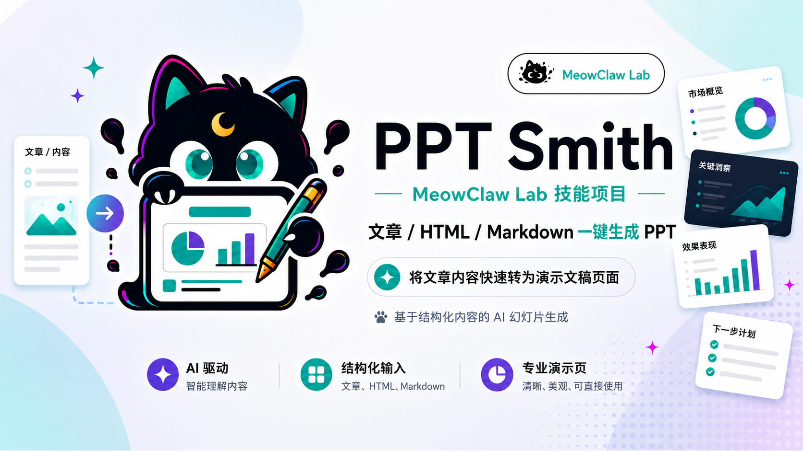
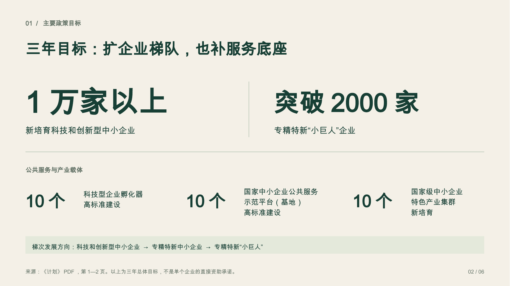
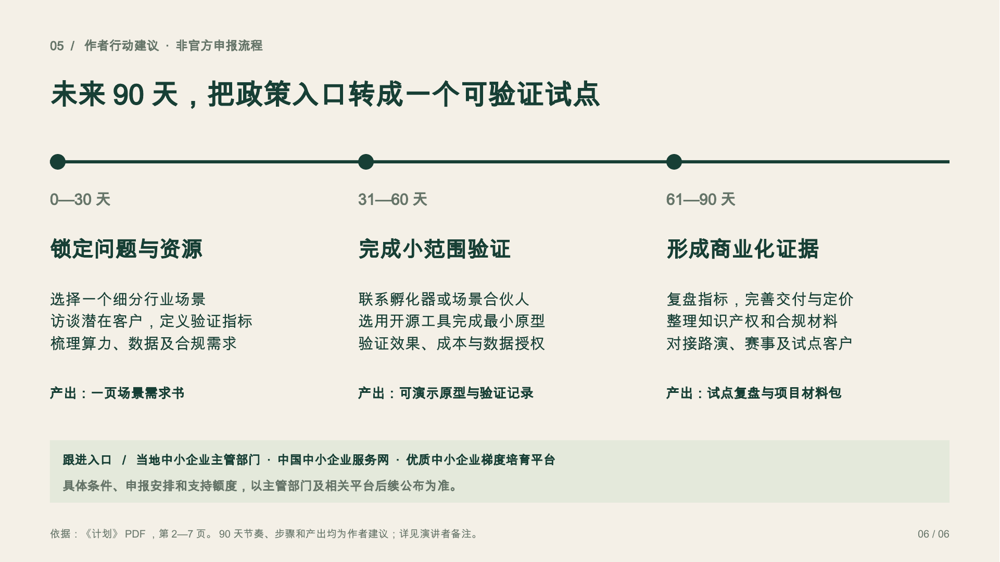
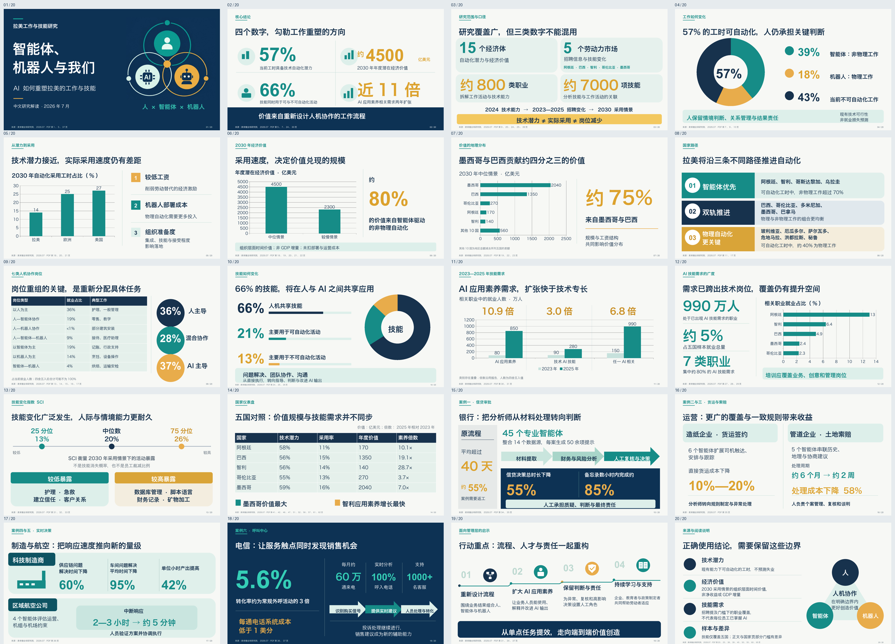
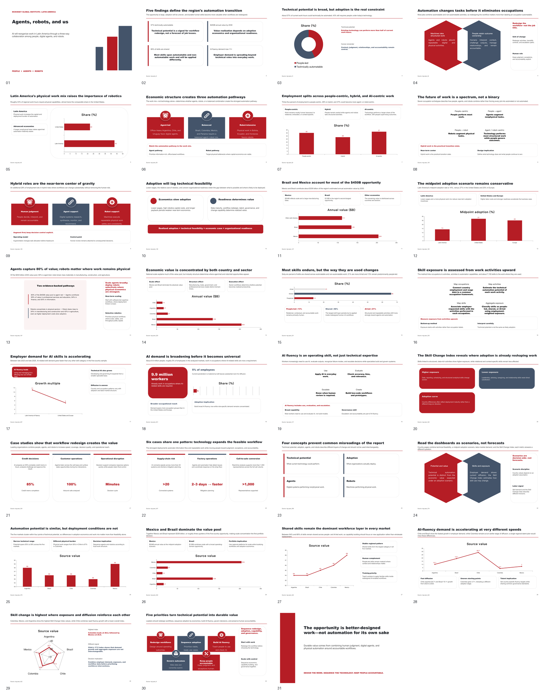
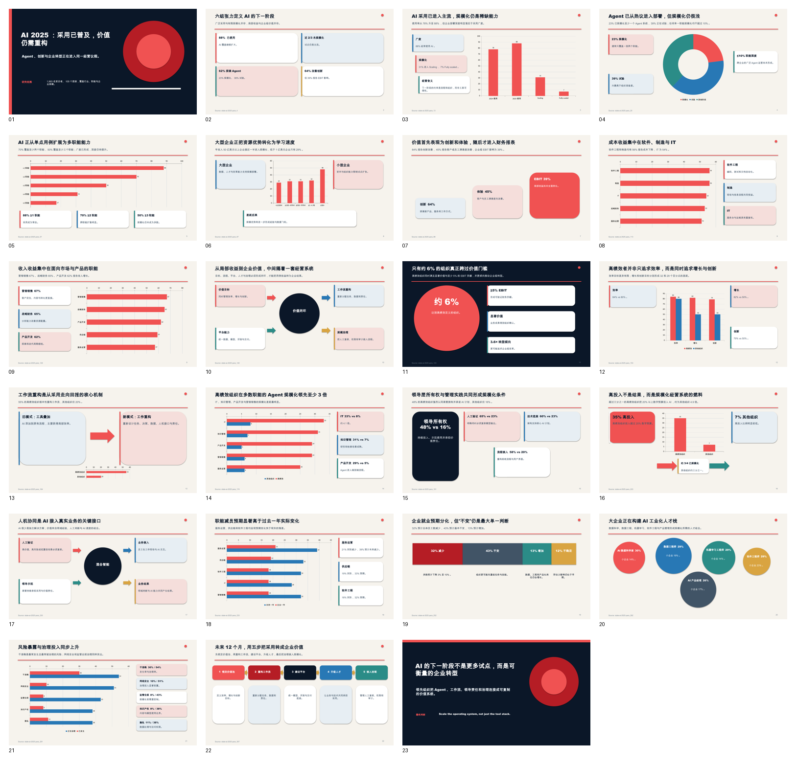

# MeowClaw PPT Smith

<p align="center">
  
</p>

> [English](README.en.md) · [Skill 执行入口](SKILL.md) · [工作流](references/declarative-design.md) · [可编辑样例](assets/samples/v5.1-no-image-policy-native.pptx)

把源文档、设计图或原生 PPT 模板，转成有来源、有真实预览、可以继续修改的演示文稿。模型负责理解内容和设计页面，固定后端负责生成原生对象与核验交付。

**当前版本：`5.1.0`。** 公共标识为 `meowclaw-pptsmith`，兼容安装名为 `article-html-to-ppt`、`meowclaw-decksmith`；许可证为 Apache-2.0。

## 适用场景：三个入口

| 你要完成的事 | 输入 | 路线与结果 |
| --- | --- | --- |
| 把报告、政策文件、PRD、文章做成汇报或课程 | 源文档；可选品牌、风格参考图 | **create 资料生成**：按内容与受众设计，生成原生 PPT 和真实预览 |
| 把设计师交稿、完整幻灯片设计图还原为可编辑 PPT | 整页设计图；用于核对文字和数值的源文档 | **recreate 设计图还原**：重建对象，并对照冻结目标检查差异 |
| 使用公司或客户的 PPTX 模板 | 原生 PPTX 模板与源材料 | **template 模板复用**：分析并复用原生组件，按模板视觉规则补充缺口 |

只有风格参考图时通常使用 create；要求忠实还原整页时使用 recreate。原生模板交给独立的 Template 工作流，不转为截图底稿。资料页数不等于演示页数，页数预算应依据受众、目的和信息密度确定。

**设计风格不固定。** 配色、字体、构图、图表和页面节奏由当前内容、受众与品牌约束决定。复用的样式、来源索引和图标只是减少重复描述，不会强制所有页面套用同一组卡片。

## 没有生图模型，也能出设计预览

默认原创流程：

```text
完整源材料 → 内容与来源整理 → 结构化设计
→ 原生可编辑 PPTX → LibreOffice PDF → PNG 预览
→ 独立视觉审核与修订 → 编辑回存检查 → 最终交付
```

具备视觉理解和文本输出能力的模型，可以编写页面设计并检查程序渲染的图片；无需直接生成图片。这里会先产生内部原生候选，再得到设计预览。生图工具可选，用于独立插画或用户明确要求的外部设计目标。

| 当前能力 | 可以怎样使用 |
| --- | --- |
| 能识图，无生图工具 | 创建原创页面、还原已有设计图、检查真实预览 |
| 能识图，也能生图 | 在上述流程中按需补充独立图片素材 |
| 只有文本模型 | 可以编写结构化设计；图像理解和独立视觉验收仍需视觉模型或人工 |
| 缺少办公软件或渲染工具 | 可以准备内容与设计；补齐真实渲染后才能最终交付 |

复杂摄影和自由插画仍需要合格素材。当前声明式入口不接受任意 HTML/CSS、SVG 或模型脚本，也不承诺任意设计图都能无损拆解。可恢复数据的图表、表格使用原生数据；独立图片仅可替换，不等于内部元素可编辑。

## v5.1 实测：无生图的 6 页中文政策解读

输入为用户提供的 7 页《人工智能中小企业创业支持计划（2026—2028年）》PDF。独立作者只使用新版 Skill 和源文档完成原创稿，未调用生图工具。输出包括 6 页中文内容、逐页来源和 6 页演讲者备注；90 天行动步骤明确标为作者建议。

**下载同一份 [可编辑 PPTX](assets/samples/v5.1-no-image-policy-native.pptx)**，或查看 [对象统计与验收摘要 JSON](assets/samples/v5.1-no-image-policy-evidence.json)。以下图片均直接来自该 PPTX 的真实办公软件渲染，没有重绘或美化截图。

### 封面：13 个文本对象 + 6 个原生形状


### 目标页：16 个文本对象 + 3 个原生形状



### 行动页：18 个文本对象 + 5 个原生形状



统计直接读取交付 PPTX，每个文本框或形状计一次：

| 页码与内容 | 原生文本 | 原生形状 | 可编辑对象合计 |
| --- | ---: | ---: | ---: |
| 1 · 政策导航 | 13 | 6 | 19 |
| 2 · 三年目标 | 16 | 3 | 19 |
| 3 · 要素供给 | 15 | 4 | 19 |
| 4 · 主体培育 | 12 | 3 | 15 |
| 5 · 开源与保障 | 20 | 5 | 25 |
| 6 · 作者行动建议 | 18 | 5 | 23 |
| **全稿** | **94** | **26** | **120** |

本例图片、原生图表、原生表格和分组均为 **0**，6 页均有备注。数字是可编辑文本，不把它们称为原生图表；装饰线和圆点计入形状，备注、字符数不重复计入对象数。对象数量用于说明编辑结构，不作为设计质量分数。

该候选已通过独立逐页视觉与来源审核，门禁状态为 `final_delivery_ready`。在 **macOS + LibreOffice 26.2.4.2** 中通过 Basic/UNO 修改副本的文字、数字文字及形状颜色，保存、关闭、重开后验证修改保留、6 页备注完整，原候选文件未改变。此为实际应用对象编辑测试，并非 GUI 点击测试；不外推为 Windows/Linux 或 PowerPoint/WPS 实机验证。样例使用 Arial Unicode MS，字体未嵌入，换设备需检查字体与排版。

## v5.0 实测保留：20 页中文研究解读

输入为 67 页 *Agents, robots, and us: How AI reshapes work and skills in Latin America* 报告，输出 20 页《智能体、机器人与我们》中文研究解读，涵盖自动化潜力、经济价值、岗位与技能、国家对照和企业案例。每页均有来源与演讲者备注。这是 v5.0 阶段的真实历史成品，单独统计，不与上面的 v5.1 案例混算。

流程为“源文档 → 完整页面设计图 → 多模态识读与声明式重建 → 原生 PPTX → 实际渲染与验收”。以下保留原交付的 20 页总览图；[下载原始可编辑 PPTX](assets/samples/v5.0-latin-america-ai-zh-native.pptx)，[查看逐页对象数据](assets/samples/v5.0-latin-america-ai-zh-evidence.json)。



| 对象类别 | 数量 | 可编辑范围 |
| --- | ---: | --- |
| 原生文本框 | 274 | 修改文字、字体、字号与颜色 |
| 原生形状与路径 | 164 | 移动、缩放与改色 |
| 原生图表 | 7 | 修改数据系列；附 7 个内嵌工作簿 |
| 原生表格 | 2 | 修改单元格、行列和样式 |
| **原生可编辑对象合计** | **447** | **274 + 164 + 7 + 2** |
| 独立封面图片 | 1 | 可整体替换，内部插画元素不可逐个编辑 |
| **幻灯片对象总数** | **448** | **447 个原生对象 + 1 张图片** |

统计直接读取原交付 PPTX，每个对象只计一次；图表数据点、表格单元格、7 个数据工作簿和 20 页备注不重复计数。

<details>
<summary>展开 20 页可编辑对象明细</summary>

| 页码 | 文本 | 形状/路径 | 图表 | 表格 | 原生可编辑合计 | 可替换图片 |
| --- | ---: | ---: | ---: | ---: | ---: | ---: |
| 1 | 7 | 2 | 0 | 0 | 9 | 1 |
| 2 | 15 | 18 | 0 | 0 | 33 | 0 |
| 3 | 19 | 6 | 0 | 0 | 25 | 0 |
| 4 | 13 | 5 | 1 | 0 | 19 | 0 |
| 5 | 14 | 7 | 1 | 0 | 22 | 0 |
| 6 | 9 | 3 | 1 | 0 | 13 | 0 |
| 7 | 9 | 3 | 1 | 0 | 13 | 0 |
| 8 | 16 | 10 | 0 | 0 | 26 | 0 |
| 9 | 11 | 5 | 0 | 1 | 17 | 0 |
| 10 | 13 | 8 | 1 | 0 | 22 | 0 |
| 11 | 9 | 3 | 1 | 0 | 13 | 0 |
| 12 | 12 | 5 | 1 | 0 | 18 | 0 |
| 13 | 15 | 9 | 0 | 0 | 24 | 0 |
| 14 | 7 | 3 | 0 | 1 | 11 | 0 |
| 15 | 20 | 9 | 0 | 0 | 29 | 0 |
| 16 | 15 | 6 | 0 | 0 | 21 | 0 |
| 17 | 16 | 13 | 0 | 0 | 29 | 0 |
| 18 | 20 | 9 | 0 | 0 | 29 | 0 |
| 19 | 17 | 28 | 0 | 0 | 45 | 0 |
| 20 | 17 | 12 | 0 | 0 | 29 | 0 |
| **全稿** | **274** | **164** | **7** | **2** | **447** | **1** |

</details>

历史验收在 macOS + LibreOffice 26.2.4.2 中通过 Basic/UNO 修改副本的文字、图表数据、表格数据及图片，保存、关闭、重开后改动均保留。设计图与原生重建在字体、图标、渐变及图表样式上仍有差异，不宣称逐像素 1:1；未进行 PowerPoint/WPS 实机验证。使用的 Hiragino Sans GB、Arial 未嵌入，换设备需核对字体与排版。

## 怎么用：把目标交给 Agent

让支持读取 Skill、运行本地工具的宿主加载本目录 [SKILL.md](SKILL.md)，然后提供源材料和需求。普通用户无需手写对象 JSON。

**文档生成，无生图工具：**

```text
使用 PPT Smith，把这份 PDF 做成约 10 页中文可编辑 PPT。
受众：中小企业负责人；目标：理解政策重点并形成行动清单。
当前模型能识图，无生图工具。根据内容建议配色与页面结构，
保留数字限定词、逐页来源和演讲者备注；作者建议与原文明确区分。
完成真实预览、独立审核及目标软件编辑回存验证后交付。
```

**根据设计图还原：**

```text
以这些完整页面设计图为还原目标，以 PDF 为文字与数字依据。
保留已批准的版式；如设计图与源文档冲突，列明需要修正的内容。
标题、正文、可恢复数据的图表和表格使用原生对象，
说明独立图片与复杂效果的编辑边界，并提供目标/实际预览对照。
```

**沿用模板：**

```text
用这个公司 PPTX 模板把报告整理成 15 页中文汇报。
优先复用原生组件，保留品牌字体和配色，附来源与讲稿。
模板放不下时调整页面结构并说明，最终验证目标软件中的编辑与保存。
```

**只修改几处内容：**

```text
基于上一份任务，只改第 6 页标题和第 7 页备注，其余保持。
用对象补丁提交改动，重新审核受影响页面；
未变页面仅通过有效审核继承机制复用记录。
```

首次说明受众、目的、语言、页数预算、目标软件，以及参考图是“风格参考”还是“精确还原目标”。后续带上原任务目录和需要修改的页/对象，Agent 可按页读取上下文，不必反复粘贴整份材料。

## 减少重复输入与返工

- **按需加载**：Skill 入口只保留公共规则，路线说明按任务读取。
- **紧凑作者输入**：样式、来源、颜色变量和装饰符号只定义一次，固定编译器展开为严格对象。
- **短摘要与分页查询**：默认返回构建状态、变更页和证据路径；详细内容按页读取。
- **真实字体预检**：在批量铺页前检查实际办公软件使用的字体与字符，结果按环境缓存。
- **版本绑定补丁与审核继承**：修改少量内容不必重写整份 JSON。备注或底层数据改变，即使预览像素相同，也会使相关审核失效。

同一份 6 页任务的实测体积如下，紧凑输入展开后与完整任务完全一致：

| 测量对象 | 原始/完整 | 优化/紧凑 | 字节减少 |
| --- | ---: | ---: | ---: |
| Skill 入口（v5.1 开发验收快照，对比 v5.0.1） | 14,384 | 6,278 | 56.4% |
| 同一任务作者输入 | 69,702 | 42,808 | 38.6% |
| 同一构建的 CLI 回显 | 24,550 | 631 | 97.4% |

单位为 UTF-8 字节；作者输入采用相同 canonical JSON 编码。[测量口径与摘要](assets/samples/v5.1-no-image-policy-evidence.json)随样例提供。**这些不是实测 token、费用或运行时间降幅。** 完整来源、原生对象、构建和审核证据仍保留。当前每次修订仍完整构建与真实渲染；继承减少重复审阅，不是页级渲染缓存。

## 安装与本地自检

在 Skill 根目录安装 Python 依赖；以下为 macOS/Linux 的 Bash 示例：

```bash
python3 -m venv .venv
source .venv/bin/activate
python -m pip install -r requirements.txt
python scripts/check_identity.py
python scripts/quick_validate_skill.py
python -m engine design capabilities
```

真实预览与字体预检还需要 **LibreOffice、Poppler（pdftoppm、pdffonts、pdftotext）、Fontconfig（fc-match）及任务所用字体**。工具应可从 PATH 发现。Windows 使用相应虚拟环境 Python 入口；工具安装与系统差异见 [跨平台运行条件](references/declarative-design.md#跨平台运行条件)。`capabilities` 检测本地工具，不自动识别宿主模型是否能识图或生图。

以下命令展示 Agent 的创建流程，`author.json` 由模型依据源材料编写，必须位于任务目录内；`init` 本身不解析 PDF 或自动设计页面：

```bash
PPTSMITH_TASK="./ppt-work/demo"
python -m engine design init --task-dir "$PPTSMITH_TASK" --task-id demo --mode create --pages 6
python -m engine design author --task-dir "$PPTSMITH_TASK" --file author.json
python -m engine design preflight --task-dir "$PPTSMITH_TASK" --isolation auto
python -m engine design build --task-dir "$PPTSMITH_TASK" --isolation auto
```

构建成功仅产生候选。继续使用返回的构建 ID 生成审核表、完成独立审核和真实编辑检查，再执行 `review`、`deliver`。任务目录的 `state.json` 记录接续信息，`task.json`、构建 manifest 和原始审核记录保留完整证据。完整命令见 [声明式工作流](references/declarative-design.md)与 [紧凑输入/局部修订](references/declarative-authoring.md)。

只有使用依赖 PptxGenJS 的兼容构建器时，才需准备 Node/npm 并执行：

```bash
python scripts/bootstrap_pptxgenjs_runtime.py
```

该脚本在 `runtime/pptxgenjs` 内执行锁定版本的 `npm ci`。

## 交付与兼容边界

最终交付包括可编辑 PPTX、实际 PDF/PNG 预览、任务及素材记录、对象清单、审核结论和编辑限制。标题、正文、图形和可恢复的数据优先保留原生编辑能力；未经批准的整页截图不能充当可编辑成品。

PPT 质量与 OS 隔离分别验证。`--isolation auto` 在可用的 macOS 环境选择隔离模式，其他环境选择 host；host 通过质量门禁后可交付，并记录 OS 隔离未验证。显式指定 `--require-os-isolation` 时，能力不足仍阻断。运行时适配不等于所有操作系统或办公软件都已实机通过。

原生模板继续使用 [Template 工作流](references/routes/v4-template-route.md)。Bespoke 保留为高级兼容路线，Standard/Engineering 用于明确的工程草稿和诊断。`new_design`、`style_transfer` 新建参数映射到 create；已有旧任务继续遵守原来的目标要求。受限浏览器设计板、模板索引缓存和实际模型成本仪表尚未纳入本版。

## 历史样例

以下为较早版本的真实渲染样例，不计入上面的 v5.1 对象统计。

<details>
<summary>展开 V4 Template 与 Bespoke 示例</summary>

**Template：31 页研究报告演示。** 基于源报告和原生模板组件完成编排，29 个正文页具备演讲者备注。



**Bespoke：23 页独立设计演示。** 从空白页面制作，含 12 个原生图表和 23 页备注。两份样例使用不同报告，不作为同源质量比较，也不表示与源报告出版方或模板品牌存在合作、授权或背书关系。



更多历史资源见 [样例目录](assets/samples/)。

</details>

## 文档与分发

- [SKILL 执行规范](SKILL.md)
- [声明式工作流、原生能力与验收](references/declarative-design.md)
- [紧凑作者输入、对象补丁与审核继承](references/declarative-authoring.md)
- [Template 模板复用](references/routes/v4-template-route.md) · [Bespoke 高定兼容](references/routes/v4-bespoke-route.md)
- [V4 路线架构](references/routes/v4-three-route-architecture.md) · [历史导出能力](references/export-pipelines.md)
- [样例证据](assets/samples/v5.1-no-image-policy-evidence.json)

GitHub、ClawHub 等公开分发仅包含 Skill 运行代码、依赖声明、使用文档、模板/Schema，以及本文引用的示例与必要数据。开发测试、CI、开发笔记、推广文章、原始输入、完整验收日志、临时产物和本地工作树不进入公开版本。

本地构建和预览不自动发布文件；源材料如何传给宿主模型取决于宿主配置。飞书/Lark 云端创建、上传或分享仅在用户授权相应交付时执行。

核心引擎、通用组件、可编辑对象与 QA 以 Apache-2.0 开源。企业品牌适配、专属母版、行业生产包、定制组件与代生成/部署服务独立商业交付，不包含在公共仓库或 Skill 分发包中。
