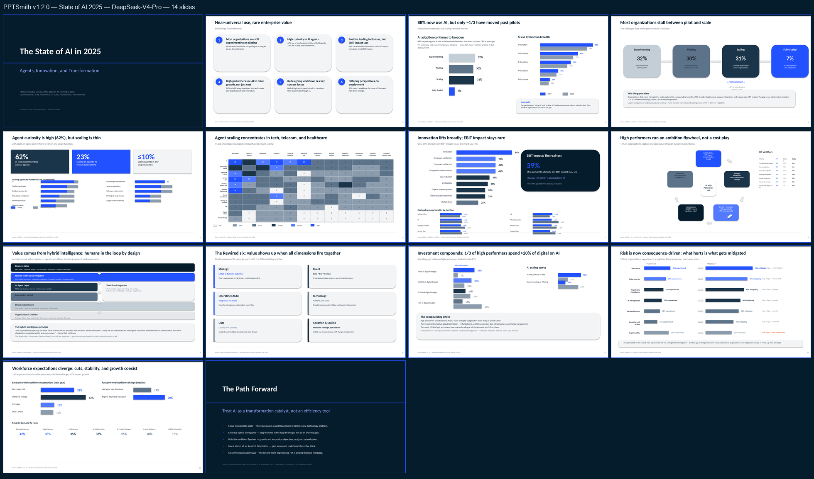
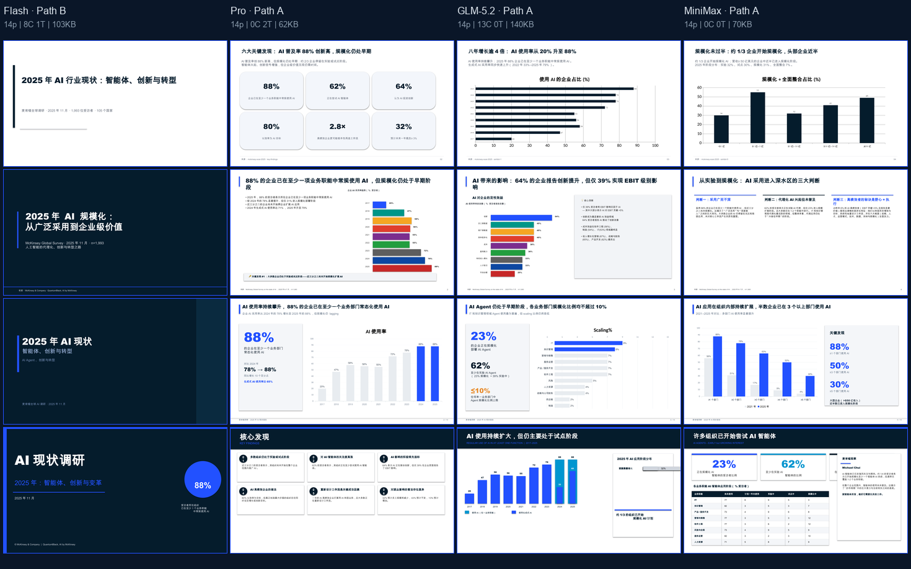

# PPTSmith v3.0.0 发布说明：双路径生成与 v1.2.0 对比

PPTSmith v3.0.0 将 **高保真直接代码生成** 与 **可审计的 IR / Pipeline 生产**并列为正式路径：不再把“可验证”误当成“只能模板化”，也不把“代码自由度”误当成“无需验证”。

## 这次发布的核心变化

- **Path A — Code Path（高定 / 精细化）**：LLM 直接编写独立 `python-pptx` 构建脚本，适合董事会材料、投资人路演、公开发布和需要非对称布局、飞轮、复杂原生箭头或页面级精修的场景。
- **Path B — IR / Pipeline（标准 / 可追溯）**：以 PPT IR、Style Contract、组件路由、真实渲染与 QA 门禁构建，适合批量生成、标准交付、PMO/PRD/技术材料和需要可追溯证据的任务。
- **八条专业路线**：战略决策、投资商业/尽调、产品 PRD、技术架构、项目治理、研究洞察、教育说明、品牌内容传播；同一输入默认只选择一条与真实场景匹配的生产路线。
- **Visual Narrative Pipeline**：在 IR 前加入任务/受众路由、故事线、Page Design Intent、Visual Planner、Deck Rhythm 和受约束的视觉修订请求。
- **原生可编辑能力扩展**：新增或强化热力矩阵、因果链、分层架构、下钻阶梯、阶段路线图、产品界面概览与交互故事板；保留 2.0.7 的直线、肘形与曲线连接器拓扑约束。
- **Standard 交付边界**：在已验证的 macOS + LibreOffice 环境上，以真实渲染、结构回读与 QA 支撑 `verified`；Premium / Microsoft PowerPoint 像素一致性仍必须在目标环境单独验收。

## v1.2.0 与 v3.0.0：什么保留了，什么改变了

| 维度 | v1.2.0 | v3.0.0 |
| --- | --- | --- |
| 主要生成方式 | LLM 直接写 `python-pptx`，页面级自由布局 | Path A 保留直接代码；Path B 提供 IR/Pipeline |
| 飞轮、左右分栏、定制原生箭头 | 可以由代码直接构建，质量取决于模型 | Path A 同样支持；Path B 按组件与能力路由，必要时 fail-closed |
| 稳定性与可追溯性 | 依赖单次生成与人工检查 | Source Context、PPT IR、Style Contract、Build/QA/Delivery Manifest 可追溯 |
| 受众/场景适配 | 通用提示驱动 | 八条专业路线 + Visual Narrative 规划 |
| 质量控制 | 以渲染和人工经验为主 | 结构检查、真实渲染、文本溢出/对比度/连接器/可编辑性门禁；Path A 仍需人工视觉复核 |
| 推荐使用方式 | 适合高能力模型的自由创作 | 重要高定 → Path A；批量/标准化/需审计 → Path B |

### 为什么 v1.2.0 有时会出现更强的视觉页

v1.2.0 的顶级案例来自模型直接编写页面专属代码，而不是通用 Builder 模板。例如，下图的飞轮、圆角节点、曲线箭头和右侧对比表均可作为 PowerPoint 原生对象编辑；这也是 v3.0.0 把 Path A 恢复为正式路径的原因。

> 证据范围：该图为 **DeepSeek‑V4‑Pro** 在 `State of AI 2025` 上的 14 页 v1.2.0 直接代码生成接触表。它适合查看页面结构与组件多样性，不应用于逐字验证正文或脚注。

v3.0.0 不承诺每个模型、每份材料都自动达到这一上限：Path A 的质量仍取决于模型的 Python/PPTX 编码与视觉推理能力；Path B 的价值是保证受控、可复验的最低生产质量，而不是替代高定设计。

## 多模型 × 双路径试验

同一份 McKinsey *The State of AI in 2025* 材料被用于下列受控对比。图中每列已标出模型和路径；`C` / `T` 分别表示原生图表 / 表格数量。

| 试验列 | 路径 | 可观察结论 |
| --- | --- | --- |
| Flash · Path B | 标准 IR/Pipeline | 通过渲染器稳定提供原生图表/表格与结构化交付底线。 |
| Pro · Path A | 直接代码 | 页面可高度自定义，但本次未生成原生图表，说明代码路径不能脱离模型能力单独承诺质量。 |
| GLM‑5.2 · Path A | 直接代码 | 本次产生较高的数据密度与原生图表数量，说明强代码模型可以发挥 Path A 的上限。 |
| MiniMax · Path A | 直接代码 | 形状数量高但布局更拥挤，进一步说明 Path A 必须接受人工视觉复核。 |

> 试验结论不是通用模型排名，也不是跨供应商基准；它仅记录这个固定材料、固定任务和当次构建环境下的页面证据。模型与路径的匹配比“单一默认路径”更重要。

## 选择路径

- 选择 **Path A**：用户明确要求「精细做」「高定模式」「手写代码生成」「和之前 State of AI 一样」或「质量优先」；以及需要飞轮、复杂原生箭头、非对称分栏或逐页构图的正式场景。
- 选择 **Path B**：用户明确要求「快速生成」「标准模式」「流水线模式」，或任务强调可追溯、批量、稳定交付和质量门禁。
- **不混淆交付声明**：Path A 的 PPT 仍可以是原生可编辑，但不因“代码生成成功”自动获得 `verified` / `final`；如需正式交付，必须至少执行真实渲染和人工视觉复核。

## 迁移与兼容性

- 保留安装路径与兼容别名：`article-html-to-ppt`、`meowclaw-decksmith`。
- v2.x 的 Style Contract、PPT IR 与 Pipeline 工件保持兼容；v3.0.0 在其上新增受众/任务/视觉叙事路由与双路径选择。
- 不把未通过真实渲染、QA 或人工复核的材料宣传为最终专业成品。
